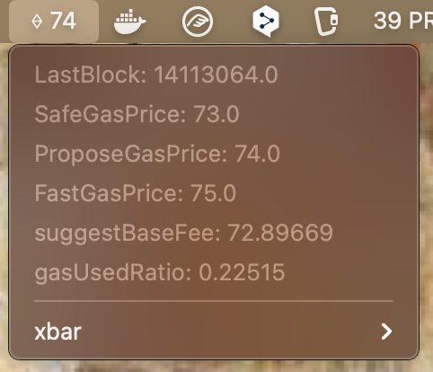
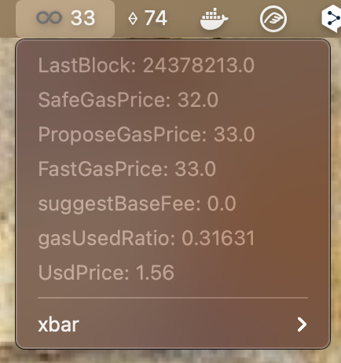

# xbar-plugins

> My plugins for [Xbar](https://xbarapp.com/) (the BitBar reboot)

✨ How to install: https://github.com/matryer/xbar#installing-plugins

## Widget for monitoring Ethereum Gas Fees

➡️ Go to `eth_gas_widget` folder

## Widget for monitoring Polygon Gas Fees

➡️ Go to `polygon_gas_widget` folder

